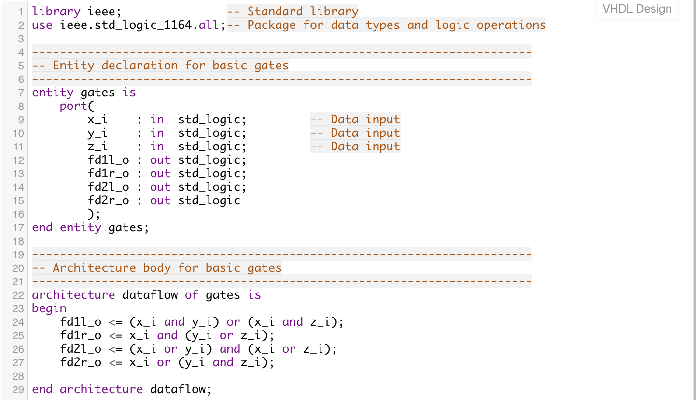
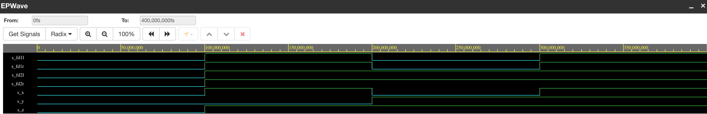

# Lab 01 - gates

## 1. Link to repository
https://github.com/yuliakyselova/Digital-electronics-1

## 2. Verification of De Morgan's laws
Link to EDA playground: https://www.edaplayground.com/x/8nwx

Listing of VHDL code design.vhd:

Table

| c | b | a | f(c,b,a) |
|---|---|-- |----------|
| 0 | 0 | 0 |     1    |
| 0 | 0 | 1 |     1    |
| 0 | 1 | 0 |     0    |
| 0 | 1 | 1 |     0    |
| 1 | 0 | 0 |     0    |
| 1 | 0 | 1 |     1    |
| 1 | 1 | 0 |     0    |
| 1 | 1 | 1 |     0    |

Screenshot with simulated time waveforms:

## 3. Verification of Distributive laws.
Link to EDA playground: https://www.edaplayground.com/x/R_JX

Listing of VHDL code design.vhd:

Screenshot with simulated time waveforms:

