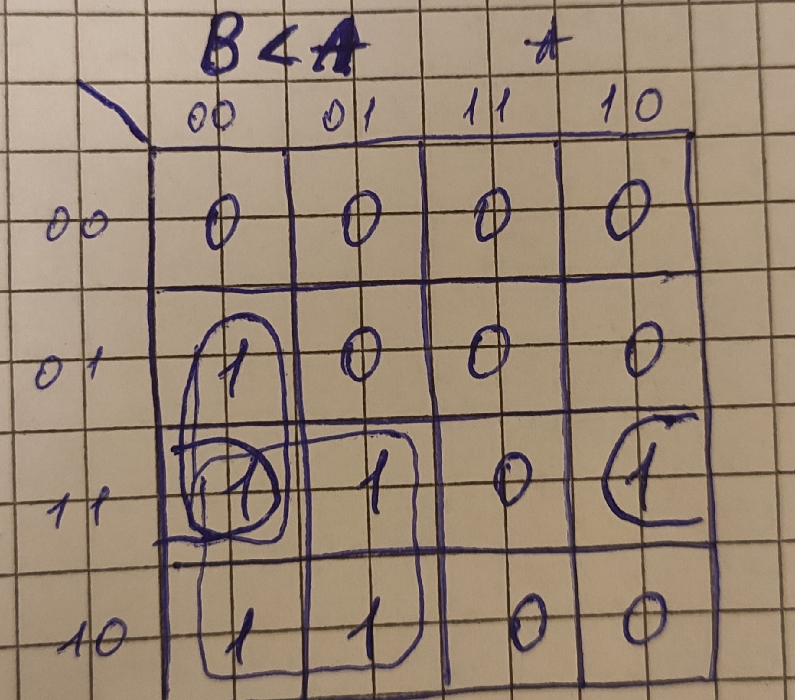
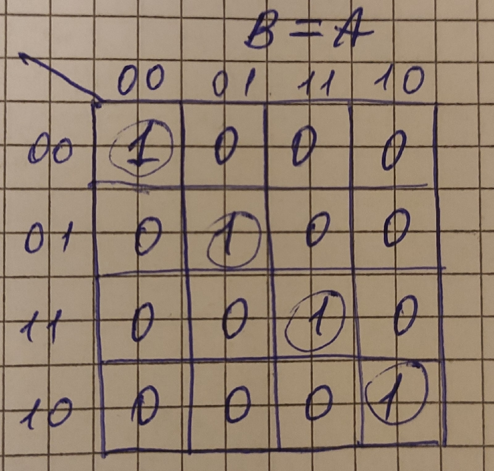
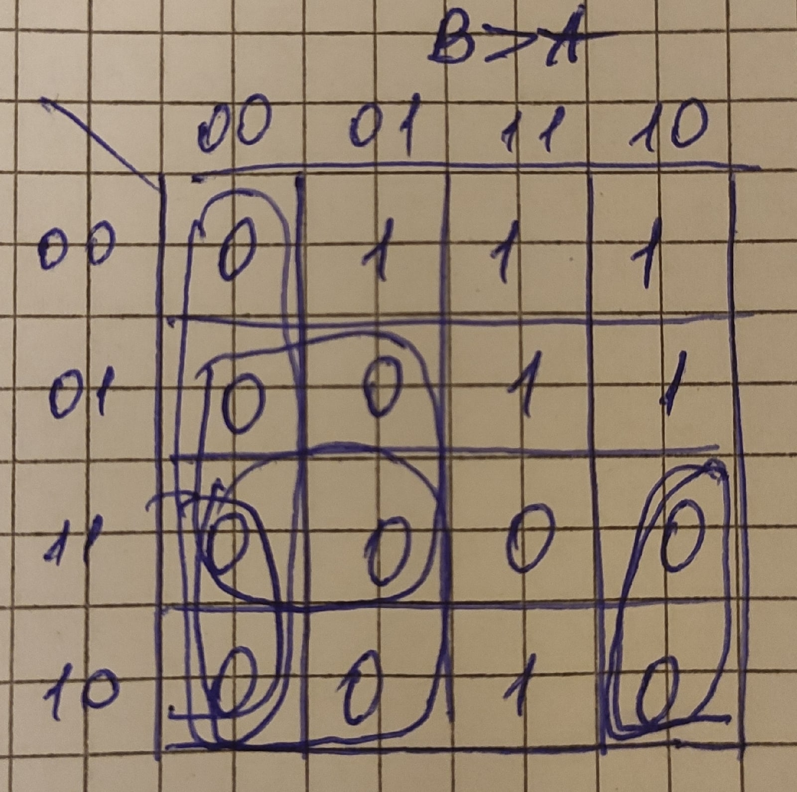
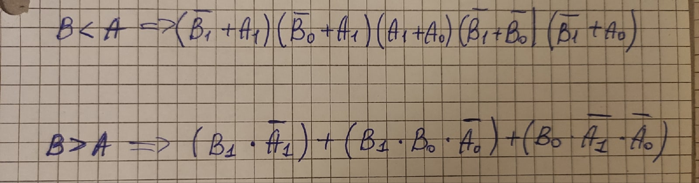

# Lab 02-logic

## 1. Truth table

| **Dec. equivalent** | **B[1:0]** | **A[1:0]** | **B is greater than A** | **B equals A** | **B is less than A** |
| :-: | :-: | :-: | :-: | :-: | :-: |
| 0 | 0 0 | 0 0 | 0 | 1 | 0 |
| 1 | 0 0 | 0 1 | 0 | 0 | 1 |
| 2 | 0 0 | 1 0 | 0 | 0 | 1 |
| 3 | 0 0 | 1 1 | 0 | 0 | 1 |
| 4 | 0 1 | 0 0 | 1 | 0 | 0 |
| 5 | 0 1 | 0 1 | 0 | 1 | 0 |
| 6 | 0 1 | 1 0 | 0 | 0 | 0 |
| 7 | 0 1 | 1 1 | 0 | 1 | 0 |
| 8 | 1 0 | 0 0 | 1 | 0 | 1 |
| 9 | 1 0 | 0 1 | 1 | 0 | 1 |
| 10 | 1 0 | 1 0 | 0 | 1 | 0 |
| 11 | 1 0 | 1 1 | 0 | 0 | 0 |
| 12 | 1 1 | 0 0 | 1 | 0 | 1 |
| 13 | 1 1 | 0 1 | 1 | 0 | 1 |
| 14 | 1 1 | 1 0 | 1 | 0 | 0 |
| 15 | 1 1 | 1 1 | 0 | 1 | 0 |

## 2. 2-bit comparator.

### Karnaugh maps

B<A

B=A

B>A

### Equations of simplified SoP form of the "greater than" function and simplified PoS form of the "less than" function.

