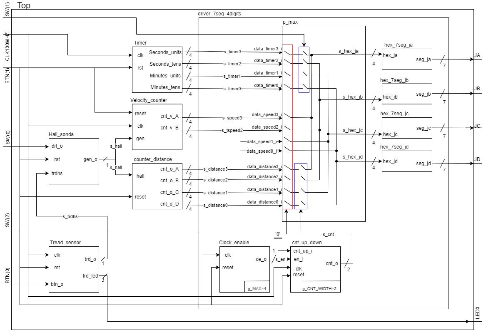
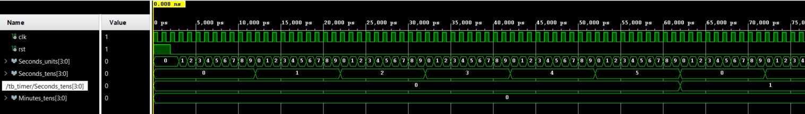
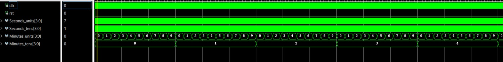
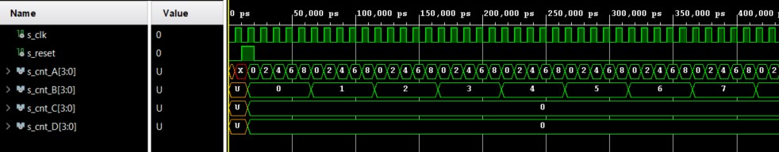
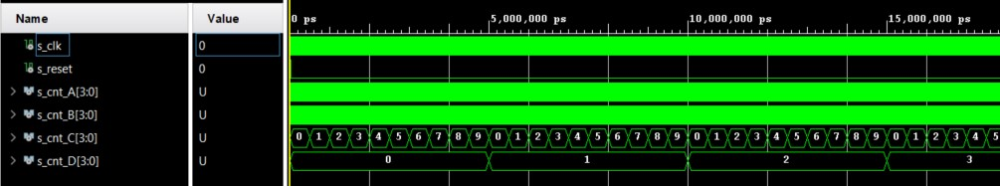
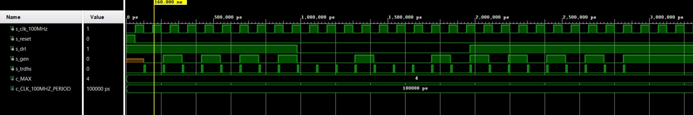
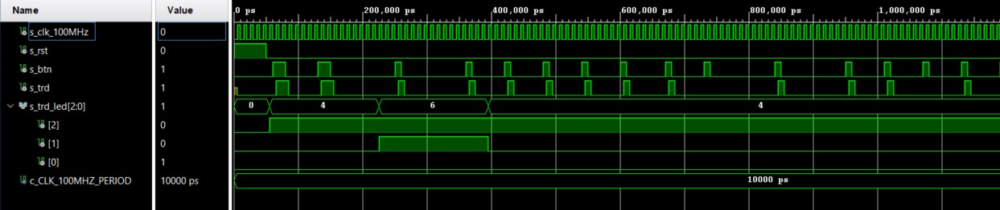
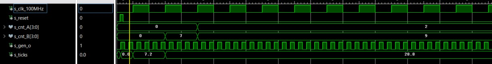
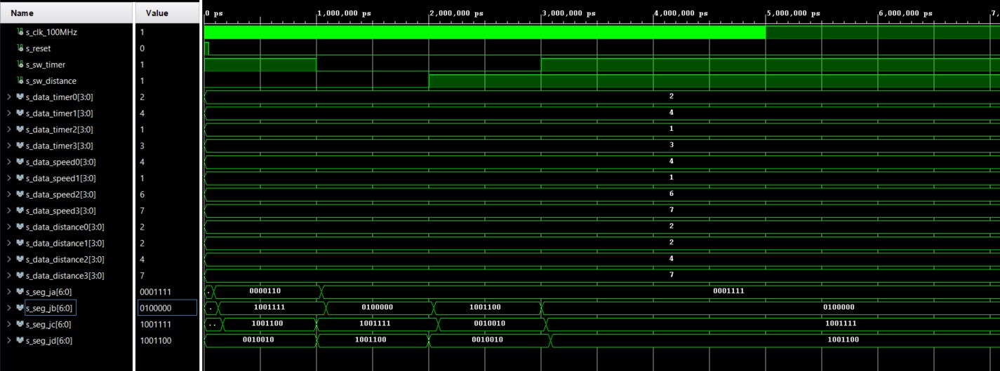
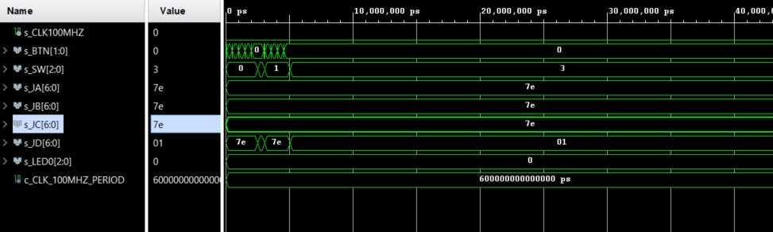

# Project - Exercise bike

### Team members

- **Krýcha Jakub** - https://github.com/xkrych01/Digital-electronics-1
- **Kyselova Yuliia** - https://github.com/yuliakyselova/Digital-electronics-1
- **Lazarević Veljko** - https://github.com/mvvelja/Digital-electronics-1
- **Levák Adam** - https://github.com/AdamLevak/Digital-electronics-1
- **Lovas Václav** - https://github.com/xlovas00/Digital-electronics-1


### Project objectives

Cíl projektu byl naprogramovat Rotoped. Veškeré moduly které jsme měli v plánu naprogramovat, jsme naprogramovali i přes menší komplikace. Kód je vypsán níže a tato úloha by se následně dala rozšířit o měření tepu srdce, či výpočet spálených kalorií.


## Hardware description

Při našem projektu jsme použili desku Arty A7-35T. Na ní využíváme jednu RGB Led diodu, dvě tlačítla (z čehož jedno siuluje šlapání a dalo by se přeprogramovat, na externí hallovu sondu), tři switche a čtyři sady pinnů (JA-JD)  na externí připojení sedmi segmentových displayů. 
Níže je vypracovaný diagram jak by celý projekt měl fungovat.

### Diagram




## VHDL modules description and simulations

### 1. Timer
VHDL code of timer module - `timer.vhd`.
```vhdl

library ieee;
use ieee.std_logic_1164.all;
use ieee.numeric_std.all;
 
entity timer is
generic(ClockFrequencyHz : integer:= 0);
port(
    clk           : in  std_logic;
    rst           : in  std_logic;
    Seconds_units : out std_logic_vector(3 downto 0);
    Seconds_tens  : out std_logic_vector(3 downto 0);
    Minutes_units : out std_logic_vector(3 downto 0);
    Minutes_tens  : out std_logic_vector(3 downto 0));
end entity;
 
architecture rtl of timer is
    signal Seconds : unsigned(5 downto 0); 
    signal Minutes : unsigned(5 downto 0); 
begin
 
    process(clk) is
    begin
        if rising_edge(clk) then
 
            -- If the negative reset signal is active
            if rst = '1' then
                Seconds <= (others => '0');
                Minutes <= (others => '0');
            else
 
                    -- True once every minute
                    if Seconds = 59 then
                        Seconds <= (others => '0');
 
                        -- True once every hour
                        if Minutes = 59 then
                            Minutes <= (others => '0');
                        else
                            Minutes <= Minutes + 1;
                        end if;
 
                    else
                        Seconds <= Seconds + 1;
          
                end if;
 
            end if;
        end if;
    end process;
 
    Seconds_units <= std_logic_vector(to_unsigned(to_integer(Seconds mod 10), 4)); 
    Seconds_tens <= std_logic_vector(to_unsigned(to_integer(Seconds/10),4)); 
    Minutes_units <= std_logic_vector(to_unsigned(to_integer(Minutes mod 10),4));  
    Minutes_tens <= std_logic_vector(to_unsigned(to_integer(Minutes/10),4)); 
 
end architecture;
```

### Simulation waveforms - simulating Timer module



### 2. Distance traveled.
VHDL code of distance traveled  module - `counter_distance.vhd`.
```vhdl
library ieee;
use ieee.std_logic_1164.all;
use ieee.numeric_std.all;

entity counter_distance is
    generic(
        g_CNT_WIDTH : natural := 4      -- Number of bits for counter
    );
    port(
        hall       : in  std_logic;       -- Clock from Hall probe
        reset      : in  std_logic;       -- Synchronous reset
        cnt_o_A    : out std_logic_vector(g_CNT_WIDTH - 1 downto 0);    -- Output data display A - units
        cnt_o_B    : out std_logic_vector(g_CNT_WIDTH - 1 downto 0);    -- Output data display B - dozens
        cnt_o_C    : out std_logic_vector(g_CNT_WIDTH - 1 downto 0);    -- Output data display C - hundreds
        cnt_o_D    : out std_logic_vector(g_CNT_WIDTH - 1 downto 0)     -- Output data display D - thousands
    );
end entity counter_distance;

architecture behavioral of counter_distance is

    -- Siganls for local counter
    signal s_cnt_local_A : unsigned(g_CNT_WIDTH - 1 downto 0);
    signal s_cnt_local_B : unsigned(g_CNT_WIDTH - 1 downto 0);
    signal s_cnt_local_C : unsigned(g_CNT_WIDTH - 1 downto 0);
    signal s_cnt_local_D : unsigned(g_CNT_WIDTH - 1 downto 0);
    

begin
    p_counter_distance : process(hall)
    begin
        if rising_edge(hall) then
        
            if (reset = '1') then               -- Synchronous reset
                -- Clear all bits
                s_cnt_local_A <= (others => '0');
                s_cnt_local_B <= (others => '0');
                s_cnt_local_C <= (others => '0');
                s_cnt_local_D <= (others => '0');

            else
                if ( s_cnt_local_A = "1000" and s_cnt_local_B = "1001" and s_cnt_local_C = "1001" and s_cnt_local_D = "1001") then
                    --Clear all bits when value is 9998
                    s_cnt_local_A <= (others => '0');
                    s_cnt_local_B <= (others => '0');
                    s_cnt_local_C <= (others => '0');
                    s_cnt_local_D <= (others => '0');
                else
                    if (s_cnt_local_A = "1000") then                        -- display A = 8 -> reset display A
                        s_cnt_local_A <= "0000";
                        if (s_cnt_local_B = "1001") then                    -- display B = 9 -> reset display B
                            s_cnt_local_B <= "0000";
                            if (s_cnt_local_C = "1001") then                -- display B = 9 -> reset display C
                                s_cnt_local_C <= "0000";
                                if (s_cnt_local_D = "1001") then            -- display B = 9 -> reset display D
                                    s_cnt_local_D <= "0000";
                                else
                                    s_cnt_local_D <= s_cnt_local_D + 1;     -- data(display D) + 1
                                end if;
                            else
                                s_cnt_local_C <= s_cnt_local_C + 1;         -- data(display C) + 1
                            end if;
                        else
                            s_cnt_local_B <= s_cnt_local_B + 1;             -- data(display B) + 1
                        end if;
                    else
                        s_cnt_local_A <= s_cnt_local_A + 2;                 -- data(display A) + 1
                    end if;
                end if;
            end if;
        end if;
    end process p_counter_distance;

    -- Output must be retyped from "unsigned" to "std_logic_vector"
    cnt_o_A <= std_logic_vector(s_cnt_local_A);
    cnt_o_B <= std_logic_vector(s_cnt_local_B);
    cnt_o_C <= std_logic_vector(s_cnt_local_C);
    cnt_o_D <= std_logic_vector(s_cnt_local_D);

end architecture behavioral;

```
### Simulation waveforms - simulating counter_distance module



### 3. Hall sensor.
VHDL code of hall sensor module - `hall_sonda.vhd`.
```vhdl
library IEEE;
use IEEE.STD_LOGIC_1164.ALL;

entity hall_sonda is
    generic(
        g_MAX : natural := 4    
    );
    
    Port ( 
        clk   : in std_logic;
        rst   : in std_logic;
        trdhs : in std_logic;       -- input from tread sensor
        drl_o : in std_logic;       -- hardest or easiest 
        gen_o : out std_logic       -- generate pulse
    );
end hall_sonda;

architecture Behavioral of hall_sonda is
    
    signal s_cnt_local : natural;       -- local counter

begin
    p_hall_sonda : process(trdhs)
    begin
        if rising_edge(trdhs) then       -- set 
            if (rst = '1') then          -- High active reset
                s_cnt_local  <= 0;       -- Clear local counter
                gen_o        <= '0';
            -- easy level for treading
            elsif (drl_o = '0') then
                if (s_cnt_local >= (g_MAX - 1)) then
                    
                    s_cnt_local  <= 0;       -- Clear local counter
                    gen_o        <= '1';     -- Generate pulse

                else
                    s_cnt_local <= s_cnt_local + 1; -- counter +1
                    gen_o        <= '0';            -- generate 0
                end if;
            -- hard level for treading   
            elsif (drl_o = '1') then
                if (s_cnt_local >= ((g_MAX - 1)/2)) then
                    
                    s_cnt_local  <= 0;       -- Clear local counter
                    gen_o        <= '1';     -- Generate pulse

                else
                    s_cnt_local <= s_cnt_local + 1; -- counter +1
                    gen_o        <= '0';            -- generate 0
                end if;
            end if;
         end if;
    end process p_hall_sonda;
    
end Behavioral;

```
### Simulation waveforms - simulating hall sensor module


### 4. Tread sensor.
VHDL code of tread sensor module - `tread_sensor.vhd`.
```vhdl
library IEEE;
use IEEE.STD_LOGIC_1164.ALL;
use ieee.numeric_std.all;


entity tread_sensor is
       
    Port ( 
        clk     : in std_logic;
        rst     : in std_logic;
        btn_o   : in std_logic;                     -- input treading
        trd_o   : out std_logic;                    -- output for hall_sond
        trd_led : out std_logic_vector(3-1 downto 0)-- output for led
    );
end tread_sensor;

architecture Behavioral of tread_sensor is
    -- type of states treading
    type t_state is (OFF,
                     BAD,
                     NORMAL,
                     GOOD,
                     PERFECT
                     );
    
    signal s_state  : t_state;
    signal clicks   : integer;
    signal s_cnt    : unsigned(5-1 downto 0);
    
    
    -- Specific values for local counter
    constant DELAY_4SEC : unsigned(5-1 downto 0) := b"1_0000";
    constant ZERO : unsigned(5-1 downto 0) := b"0_0000";
begin
   
    p_output_led : process(s_state)
    begin       -- represenation of states to RGB-LED
        case s_state is
            when OFF =>
                trd_led <= "000";
            
            when BAD =>
                trd_led <= "100";
            
            when NORMAL =>
                trd_led <= "110";
            
            when GOOD =>
                trd_led <= "010";
            
            when PERFECT =>
                trd_led <= "001";
            
            when others =>
                trd_led <= "000";
        end case;       
    end process p_output_led;
    
    p_tread_sensor : process(clk, btn_o)
    begin
        if rising_edge(clk) then    
            
            if (rst = '1') then -- synchronous reset
                clicks <= 0;
                s_state <= OFF;
                trd_o <= '0';
            else            -- calculation clicks at 4 seconds
                if (s_cnt < DELAY_4SEC) then
                    s_cnt <= s_cnt + 1;
                    
                    if (btn_o = '1') then  -- waiting for input rising edge
                        clicks <= clicks + 1;   -- click +1
                        trd_o <= '1';           -- set at output 1
                    else
                        clicks <= clicks;       -- clicks is same
                        trd_o <= '0';           -- set at output 0
                        
                    end if;    
                else                            -- dysplaing the intensity of treading
                    if (clicks <= 3) then
                        s_state <= BAD;
                
                    elsif (clicks <= 6) then 
                        s_state <= NORMAL;
                
                    elsif (clicks <= 10) then
                        s_state <= GOOD;
                    
                    else 
                        s_state <= PERFECT;
                    end if;
                    
                    clicks <= 0;                -- set clicks and local counter to 0
                    s_cnt <= ZERO;
                end if;
            end if;
        end if;
    end process p_tread_sensor;

end Behavioral;

```
### Simulation waveforms - simulating tread sensor module



### 5. Speed. 

```vhdl

library IEEE;
use IEEE.STD_LOGIC_1164.ALL;
use ieee.numeric_std.all;
use IEEE.STD_LOGIC_UNSIGNED.ALL;

entity Velocity_counter is
    generic(
        g_CNT_WIDTH : natural := 4      -- Number of bits for counter         
           );
    Port ( 
            gen        : in std_logic;
            clk        : in std_logic;
            reset      : in  std_logic;       -- Synchronous reset                       
            cnt_v_A    : out std_logic_vector(g_CNT_WIDTH - 1 downto 0);
            cnt_v_B    : out std_logic_vector(g_CNT_WIDTH - 1 downto 0);
            
            
           -- ticks      : out std_logic_vector(g_CNT_WIDTH - 1 downto 0)
            ticks      : out real
            );
end Velocity_counter;

architecture Behavioral of Velocity_counter is  
 -- Local counter    
    signal s_cnt_local_A : unsigned(g_CNT_WIDTH - 1 downto 0);
    signal s_cnt_local_B : unsigned(g_CNT_WIDTH - 1 downto 0);
         
    signal s_ticks       : real;
    signal counter       : real;
    constant kmh         : real:= 3.6;
    signal convert       : unsigned(8-1 downto 0);
    
begin

    

p_vel : process(clk,gen)
    begin
        
        if reset = '1' then
               s_ticks <= 0.0;
               counter <= 0.0;
        elsif rising_edge(gen) then                                     
               counter <= counter + 2.0;   -- counting up
        elsif rising_edge(clk) then           
               s_ticks <= counter * kmh ; 
               counter <= 0.0; 
               convert <= TO_UNSIGNED(integer(s_ticks),8);                                                                
        end if;        
    end process p_vel;
    cnt_v_B <= std_logic_vector(TO_UNSIGNED(TO_INTEGER(convert mod 10),4));
    cnt_v_A <= std_logic_vector(TO_UNSIGNED(TO_INTEGER(convert/10),4));
    
    ticks <= s_ticks;
  
end Behavioral;

```

### Simulation waveforms - simulating velocity counter module


### 6. Counter 7segment_4digits

```vhdl
library ieee;
use ieee.std_logic_1164.all;
use ieee.numeric_std.all;

entity driver_7seg_4digits is
    port(
        clk              : in std_logic;        -- Main clock
        reset            : in std_logic;        -- Synchronous reset
        sw_timer         : in std_logic;
        sw_distance      : in std_logic;
        -- 4-bit input values for individual digits
        data_timer0_i    : in  std_logic_vector(4 - 1 downto 0);    -- Timer
        data_timer1_i    : in  std_logic_vector(4 - 1 downto 0);
        data_timer2_i    : in  std_logic_vector(4 - 1 downto 0);
        data_timer3_i    : in  std_logic_vector(4 - 1 downto 0);
        
        data_speed0_i    : in  std_logic_vector(4 - 1 downto 0);    -- Speed
        data_speed1_i    : in  std_logic_vector(4 - 1 downto 0);
        data_speed2_i    : in  std_logic_vector(4 - 1 downto 0);
        data_speed3_i    : in  std_logic_vector(4 - 1 downto 0);
        
        data_distance0_i : in  std_logic_vector(4 - 1 downto 0);    -- Distance
        data_distance1_i : in  std_logic_vector(4 - 1 downto 0);
        data_distance2_i : in  std_logic_vector(4 - 1 downto 0);
        data_distance3_i : in  std_logic_vector(4 - 1 downto 0);
        -- Cathode values for individual segments
        seg_ja           : out std_logic_vector(7 - 1 downto 0);
        seg_jb           : out std_logic_vector(7 - 1 downto 0);
        seg_jc           : out std_logic_vector(7 - 1 downto 0);
        seg_jd           : out std_logic_vector(7 - 1 downto 0)
        
        
    );
end entity driver_7seg_4digits;

architecture Behavioral of driver_7seg_4digits is
   
    -- Internal clock enable
    signal s_en        : std_logic;
    -- Internal 2-bit counter for multiplexing 4 digits
    signal s_cnt       : std_logic_vector(2 - 1 downto 0);
    -- Internal 4-bit value for 7-segment decoder
    signal s_hex_ja      : std_logic_vector(4 - 1 downto 0);
    signal s_hex_jb       : std_logic_vector(4 - 1 downto 0);
    signal s_hex_jc       : std_logic_vector(4 - 1 downto 0);
    signal s_hex_jd       : std_logic_vector(4 - 1 downto 0);
    
    
begin
    --------------------------------------------------------------------
    -- Instance (copy) of clock_enable entity generates an enable pulse
    -- every 4 ms
    clk_en0 : entity work.clock_enable
        generic map(
            
            g_MAX => 4
        )
        port map(
            
            clk => clk,
            reset => reset,
            ce_o => s_en
        );

    --------------------------------------------------------------------
    -- Instance (copy) of cnt_up_down entity performs a 2-bit down
    -- counter
    bin_cnt0 : entity work.cnt_up_down
        generic map(
            
            g_CNT_WIDTH => 2
        )
        port map(
            
            clk      => clk,
            reset    => reset,
            en_i     => s_en,
            cnt_up_i => '0',
            cnt_o    => s_cnt
        );

    --------------------------------------------------------------------
    -- Instance (copy) of hex_7seg entity performs a 7-segment display
    -- decoder
    hex2seg_ja : entity work.hex_7seg_ja
        port map(
            hex_ja => s_hex_ja,
            seg_ja => seg_ja
            
        );
     
     hex2seg_jb : entity work.hex_7seg_jb
        port map(
            hex_jb => s_hex_jb,
            seg_jb => seg_jb
            
        );
        
     hex2seg_jc : entity work.hex_7seg_jc
        port map(
            hex_jc => s_hex_jc,
            seg_jc => seg_jc
            
        );
        
     hex2seg_jd : entity work.hex_7seg_jd
        port map(
            hex_jd => s_hex_jd,
            seg_jd => seg_jd
            
        );
    
    p_mux : process(s_cnt, data_timer0_i, data_timer1_i, data_timer2_i, data_timer3_i,data_speed0_i, data_speed1_i, data_speed2_i, data_speed3_i, data_distance0_i, data_distance1_i, data_distance2_i, data_distance3_i, sw_timer, sw_distance)
    begin
        
                
        case s_cnt is
               
            when "11" =>
                if (sw_timer = '1') and (sw_distance = '0') then        -- dysplay timer
                    s_hex_ja <= data_timer3_i;
                    
                elsif (sw_timer = '0') and (sw_distance = '1')then      -- dysplay istance
                    s_hex_ja <= data_distance3_i;
                    
                else                                                    -- dysplay speed
                    s_hex_ja <= data_speed3_i;
                       
                end if;

            when "10" =>
                if (sw_timer = '1') and (sw_distance = '0') then        -- dysplay timer   
                    s_hex_jb <= data_timer2_i;
                    
                elsif (sw_timer = '0') and (sw_distance = '1')then      -- dysplay istance 
                    s_hex_jb <= data_distance2_i;
                    
                else                                                    -- dysplay speed   
                    s_hex_jb <= data_speed2_i;
                        
                end if;
            
            when "01" =>
                if (sw_timer = '1') and (sw_distance = '0') then        -- dysplay timer   
                    s_hex_jc <= data_timer1_i;
                    
                elsif (sw_timer = '0') and (sw_distance = '1')then      -- dysplay distance 
                    s_hex_jc <= data_distance1_i;
                    
                else                                                    -- dysplay speed   
                    s_hex_jc <= data_speed1_i;
                        
                end if;

            when others =>
                if (sw_timer = '1') and (sw_distance = '0') then        -- dysplay timer   
                    s_hex_jd <= data_timer0_i;
                    
                elsif (sw_timer = '0') and (sw_distance = '1')then      -- dysplay istance 
                    s_hex_jd <= data_distance0_i;
                    
                else                                                    -- dysplay speed   
                    s_hex_jd <= data_speed0_i;
                       
                end if;
        end case;
    end process p_mux;

end architecture Behavioral;

```

### Simulation waveforms - simulating counter 7seg_4digits module



## TOP module description and simulations

### Diagram of `top` module.


VHDL code of top module - `top.vhd`.
```vhdl
library IEEE;
use IEEE.STD_LOGIC_1164.ALL;

entity top is
    Port ( 
        CLK100MHZ : in  STD_LOGIC;                          -- all used elements of the board
        BTN       : in  STD_LOGIC_vector(2-1 downto 0);
        SW        : in  std_logic_vector(3-1 downto 0);
        JA        : out std_logic_vector(7-1 downto 0);
        JB        : out std_logic_vector(7-1 downto 0);
        JC        : out std_logic_vector(7-1 downto 0);
        JD        : out std_logic_vector(7-1 downto 0);
        LED0      : out std_logic_vector(3-1 downto 0)

    );
end top;

architecture Behavioral of top is
    signal s_hall  : std_logic;                                 -- signals for hall_sond, velocity_counter and distance counter
    signal s_trdhs : std_logic;
    signal s_drl   : std_logic;
    
    signal s_timer0    : std_logic_vector(4 - 1 downto 0);      -- signals for output Timer
    signal s_timer1    : std_logic_vector(4 - 1 downto 0);
    signal s_timer2    : std_logic_vector(4 - 1 downto 0);
    signal s_timer3    : std_logic_vector(4 - 1 downto 0);
                                                          
    signal s_speed0    : std_logic_vector(4 - 1 downto 0);      -- signals for output Velocity_counter
    signal s_speed1    : std_logic_vector(4 - 1 downto 0);
    signal s_speed2    : std_logic_vector(4 - 1 downto 0);
    signal s_speed3    : std_logic_vector(4 - 1 downto 0);
                                                          
    signal s_distance0 : std_logic_vector(4 - 1 downto 0);      -- signals for distance counter
    signal s_distance1 : std_logic_vector(4 - 1 downto 0);
    signal s_distance2 : std_logic_vector(4 - 1 downto 0);
    signal s_distance3 : std_logic_vector(4 - 1 downto 0);
begin
  
    -- assignment inputs and outputs for all modules and connection all modules with defined signals
    trd_sensor : entity work.tread_sensor           
    port map (
        clk     => CLK100MHZ,
        rst     => BTN(1),
        btn_o   => BTN(0),
        trd_o   => s_trdhs,
        trd_led => LED0
    
    );
    
    hall_sensor : entity work.hall_sonda
    port map (
        clk   => CLK100MHZ,
        rst   => BTN(1),
        trdhs => s_trdhs,
        drl_o => SW(0)
        
    
    );
    
    timer : entity work.timer
    port map (
        clk            => CLK100MHZ, 
        rst            => BTN(1),    
        Seconds_units  => s_timer3,
        Seconds_tens   => s_timer2,
        Minutes_units  => s_timer1,
        Minutes_tens   => s_timer0
         
    );
    
    counter : entity work.counter_distance         
    port map(                     
        hall    => s_hall,     
        reset   => BTN(1),   
        cnt_o_A => s_distance3,
        cnt_o_B => s_distance2,
        cnt_o_C => s_distance1,
        cnt_o_D => s_distance0 
    );
    
    speed : entity work.Velocity_counter         
    port map(                     
        gen     => s_hall,
        clk     => CLK100MHZ,        
        reset   => BTN(1),      
        cnt_v_A => s_speed3,
        cnt_v_B => s_speed2  
    );                            
    
    driver : entity work.driver_7seg_4digits
    port map(
        clk              => CLK100MHZ,
        reset            => BTN(1),   
        sw_timer         => SW(1),
        sw_distance      => SW(2),
        
        data_timer3_i    => s_timer3,
        data_timer2_i    => s_timer2,
        data_timer1_i    => s_timer1,
        data_timer0_i    => s_timer0, 
                         
        data_speed3_i    => s_speed3,
        data_speed2_i    => s_speed2, 
        data_speed1_i    => s_speed1,
        data_speed0_i    => s_speed0,
                         
        data_distance3_i => s_distance3,
        data_distance2_i => s_distance2,
        data_distance1_i => s_distance1,
        data_distance0_i => s_distance0, 
                         
        seg_ja(0)           => JA(0),
        seg_ja(1)           => JA(1),
        seg_ja(2)           => JA(2),
        seg_ja(3)           => JA(3),
        seg_ja(4)           => JA(4),
        seg_ja(5)           => JA(5),
        seg_ja(6)           => JA(6),
                         
        seg_jb(0)           => JB(0),
        seg_jb(1)           => JB(1),
        seg_jb(2)           => JB(2),
        seg_jb(3)           => JB(3),
        seg_jb(4)           => JB(4),
        seg_jb(5)           => JB(5),
        seg_jb(6)           => JB(6),
                                    
        seg_jc(0)           => JC(0),
        seg_jc(1)           => JC(1),
        seg_jc(2)           => JC(2),
        seg_jc(3)           => JC(3),
        seg_jc(4)           => JC(4),
        seg_jc(5)           => JC(5),
        seg_jc(6)           => JC(6),
                                    
        seg_jd(0)           => JD(0),
        seg_jd(1)           => JD(1),
        seg_jd(2)           => JD(2),
        seg_jd(3)           => JD(3),
        seg_jd(4)           => JD(4),
        seg_jd(5)           => JD(5),
        seg_jd(6)           => JD(6)
                          
    );
   
    
end Behavioral;

```

### Simulation waveforms - simulating top module



## Video

### Link na video z projektu - https://www.youtube.com/watch?v=D2TzJ-XgebM


## Evaluation of project

Projekt se zakládal na znalostech základů VHDL a celkové komunikaci v týmu. 80-90% projektu, se dalo řešit přes vyřešené cvičení, jež jsme dělali. Zbytek byl úmorné hledání na internetu, jak se dá něco udělat lépe, či převést nějaká čísla na jiný datový typ. Každopádně je toto velice zajímavá zkušenost a dobrá příprava projektování, či tvoření věcí v budoucím zaměstnání.

## References

   1. https://reference.digilentinc.com/reference/programmable-logic/arty-a7/reference-manual

